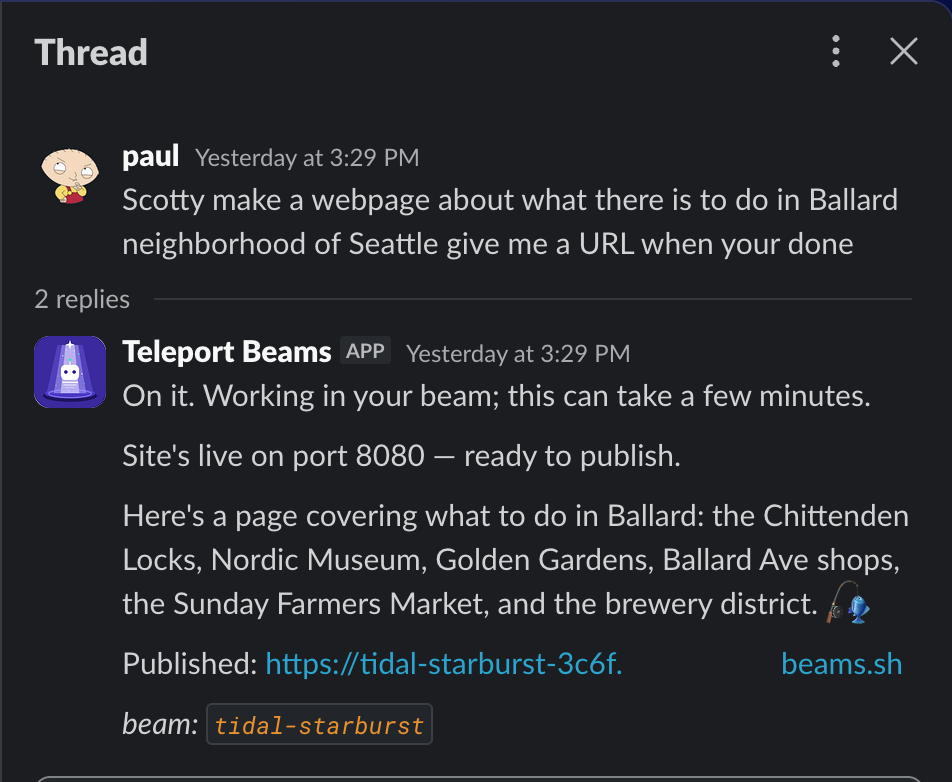
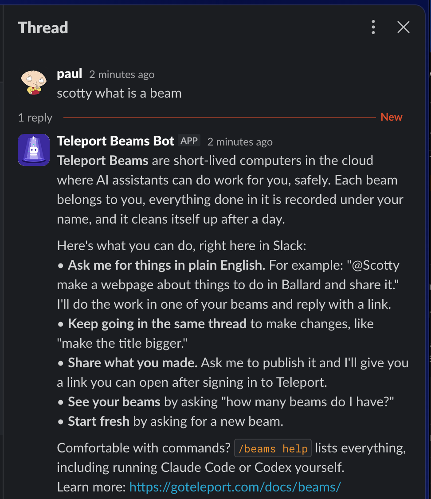
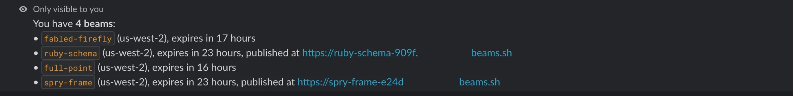
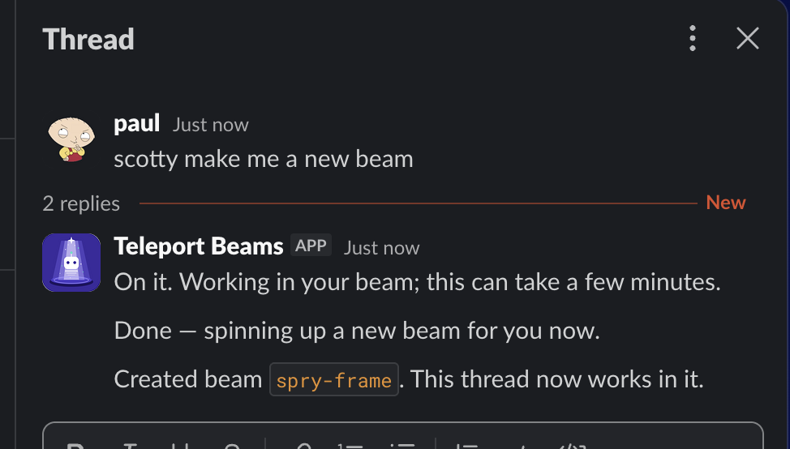
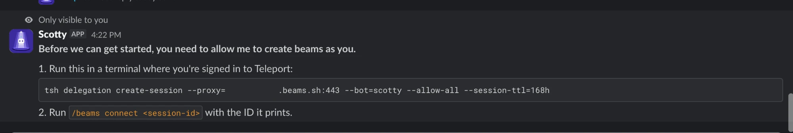
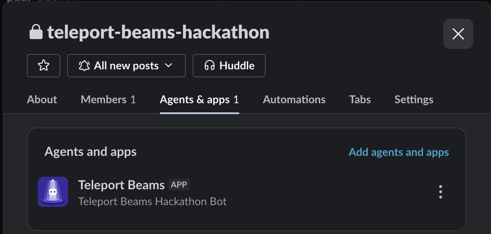

# Beams Slack Plugin


Manage [Teleport Beams](https://goteleport.com/) from Slack, either with a
`/beams` slash command or by asking **Scotty** in plain language ("@scotty
make a webpage about things to do in Seattle and publish it").

It is Teleport's Slack access plugin with a Beams app added. It is built from
the Teleport `v18.11.1` source (the newest public v18.11 tag) and ships with
`tsh` 18.11.3; the `tbot` sidecar runs 18.11.3 too. See
[Versions](#versions). It runs as a container next to `tbot`, talks to Slack over Socket Mode,
and needs no inbound ports or public URL.

## What it does

- **`/beams` slash commands**: list, create, run commands in, publish, copy
  files to, and delete beams. Replies are private to the person who ran them.
- **Scotty**: mention the app, DM it, or start a message with `scotty`.
  Scotty picks or creates one of your beams, runs Claude Code or Codex inside
  it with your request, publishes the result if asked, and replies in a
  thread. Replies in that thread continue the same beam and conversation.
- **Who you are**: the plugin looks up your Slack email, finds the Teleport
  user with that username, and lets you in only if that user has the
  configured role (`beam-user`). No list of Slack IDs to maintain.
- **Acts as you**: every beam action runs as your own Teleport user, so you
  own your beams, can open their published URLs, and only see your own. You
  authorize this once (up to 7 days) with a `tsh` command the plugin gives
  you.

Ask for a web page and get back a URL you can open:



## Usage

**Teleport Beams** are short-lived computers in the cloud where AI assistants
can do work for you, safely. Each beam belongs to you, everything done in it
is recorded under your name, and it cleans itself up after a day.

Here's what you can do, right in Slack:

- **Ask Scotty for things in plain English.** For example: "@Scotty make a
  webpage about things to do in Ballard and share it." Scotty does the work in
  one of your beams and replies with a link.
- **Keep going in the same thread** to make changes, like "make the title
  bigger."
- **Share what you made.** Ask Scotty to publish it and you get a link you can
  open after signing in to Teleport.
- **See your beams** by asking "how many beams do I have?"
- **Start fresh** by asking for a new beam.
- **Pick your assistant.** Scotty uses Claude Code unless you say "use codex"
  (or "use claude" to switch back).

Comfortable with commands? `/beams help` lists everything, including running
Claude Code or Codex yourself (see [Slash commands](#slash-commands)).

Scotty gives this same overview if you ask him "what can I do with beams?"
or "what is a beam?":



Learn more in the [Teleport Beams docs](https://goteleport.com/docs/beams/).

## Slash commands

```text
/beams help
/beams status
/beams ls
/beams add [--region=<region>]
/beams exec <name> <command...>
/beams claude <name> [--continue] <prompt...>
/beams codex <name> [--continue] <prompt...>
/beams publish <name> [--tcp]
/beams unpublish <name>
/beams rm <name>
/beams scp <src> <dst>             # remote side is <name>:<path>
/beams connect [<delegation-session-id>]
/beams disconnect
```

- `ls` lists your beams with region, time left, and published URL:

  

- `exec` runs over SSH as a single shell string, so quote commands that use
  `&&`, pipes, or redirects: `/beams exec crisp-array "cd /app && make"`.
  Other commands are split into words like a shell, so wrap any argument
  that contains an apostrophe in double quotes.
- `claude` and `codex` run a coding agent in the beam and post its answer:
  Claude Code (`claude -p`) or Codex (`codex exec`). Both come preinstalled
  and preconfigured in every beam. Each run has a 15 minute limit, and
  `--continue` (or `-c`) resumes that agent's previous conversation in the
  beam, for example `/beams codex fabled-firefly -c add a dark mode`.
  Everything after the beam name (and `-c`) is sent as typed, so prompts can
  contain apostrophes without quoting. Scotty can use either one; see
  [Scotty](#scotty).
- `publish` exposes port 8080 in the beam as a Teleport app.
- Interactive `/beams ssh` is not supported; use `exec`.
- A brand-new beam takes a moment to accept SSH; commands retry for up to 3
  minutes.
- Until you connect, every beam command replies with the authorization
  instructions instead of running.

## Scotty

Talk to Scotty in any of these ways:

- `@scotty <request>` in a channel the app is in
- a direct message to the app
- a channel message starting with `scotty` (needs the `message.channels` event)
- a reply in a thread Scotty is already working in (no mention needed)

The first time (and again when your authorization expires), Scotty replies:

> **Before we can get started, you need to allow me to create beams as you.**
>
> 1. Run this in a terminal where you're signed in to Teleport:
>    `tsh delegation create-session ...`
> 2. Reply here with the session ID it prints and I'll pick up your request.

Paste the session ID (or the whole command output) into the thread. Scotty
connects you and then carries out the request you made. This is the same
connection `/beams connect` makes, and it lasts up to 7 days.

Questions about which beams you have ("how many beams do I have", "list my
beams") are answered straight from `tsh beams ls` in a second or two. Anything
else starts a Claude Code or Codex session in a beam, which usually takes a minute or
more; Scotty posts "On it" right away so you know it is working. Scotty works
on one request per thread at a time: if you send another message while it is
busy, it replies "Still working on your earlier request" and handles your
newest message as soon as the current one finishes.


For each other request Scotty:

1. Picks one of your own beams: the one this thread already uses, a beam you
   named, or your newest. If you have none, it creates one, owned by you.
2. Runs a coding agent in that beam with your request: Claude Code by
   default, or Codex if you say "use codex", "with codex", or start with
   "codex". The thread keeps using that agent (say "use claude" to switch
   back), and switching starts a fresh conversation. The agent is told to
   serve anything it wants to share on port 8080 in the background.
3. Carries out actions the agent asks for (`publish`, `unpublish`,
   `create_beam`) from outside the beam, since it cannot manage beams from
   inside the VM.
4. Replies in the thread with the agent's answer and any published URL.

Asking for another beam creates one, and the rest of that thread works in it:



Scotty cannot delete beams; use `/beams rm`.

Scotty is an engineer, not a transporter operator, so don't ask him for a
lift.

## Authorizing the plugin to act as you

Teleport v18 does not let a bot impersonate an SSO user, and only you can
create a delegation session for yourself (with MFA). So the first time you use
`/beams` or Scotty, and again when your authorization expires, the plugin
replies:

> **Before we can get started, you need to allow me to create beams as you.**
>
> 1. Run this in a terminal where you're signed in to Teleport:
>    `tsh delegation create-session --proxy=example-beams-tenant.beams.sh:443 --bot=scotty --allow-all --session-ttl=168h`
> 2. Run `/beams connect <session-id>` with the ID it prints.

This is how the prompt looks in reply to a slash command (the tenant name is
hidden):



Run it, then hand back the session ID it prints:

- with Scotty: reply in the thread (no mention needed); Scotty then carries
  out the request you made
- with slash commands: `/beams connect <session-id>`

For the next 7 days every beam action runs as your Teleport user: beams are
owned by you, published URLs open for you, and Teleport keeps your beams
separate from everyone else's. `/beams disconnect` forgets the session.

The plugin never creates or touches beams as its own bot identity.

## Setup

### 1. Teleport

The plugin runs as a Machine ID bot (named `scotty` here). Its role needs
`read` and `list` on `user` and `user_login_state` so it can match Slack
emails to Teleport users. The deployment uses `access-plugin` (the role
Teleport's Slack plugin normally uses, extended with those rules) plus
`beam-user`. Beam actions themselves run as each user through delegation, so
the bot does not strictly need `beam-user` any more.

```sh
tctl bots add scotty --roles=access-plugin,beam-user    # or: tctl bots update scotty --set-roles=...
tctl bots instances add scotty                         # prints a one-time join token
```

Each person who uses the plugin needs a Teleport user whose username is their
Slack email (true for typical SSO setups) and the `beam-user` role. SSO users
only exist in Teleport while their login is current, so someone who has never
signed in is told to sign in once and retry.

### 2. Slack app

Create or update a Slack app at <https://api.slack.com/apps>:

- **Socket Mode**: on. Create an app-level token (`xapp-...`) with
  `connections:write`.
- **Slash Commands**: add `/beams`.
- **Event Subscriptions**: on (no request URL needed with Socket Mode).
  Subscribe to bot events `app_mention`, `message.im`, `message.channels`,
  and `message.groups` for private channels. The plugin ignores channel
  messages that are not meant for Scotty.
- **OAuth & Permissions, Bot Token Scopes**: `commands`, `chat:write`,
  `users:read`, `users:read.email`, `app_mentions:read`, `im:history`,
  `channels:history`, `groups:history`.
- **App Home**: enable the Messages tab and "Allow users to send messages".
  Set the display name to `scotty`.
- **App icon**: see [Set Scotty's icon](#set-scottys-icon) below.
- **Install / Reinstall to Workspace** after any scope change, then
  `/invite` the app to the channels where it should listen. Once added, it
  shows under the channel's **Agents & apps** tab:

  

#### Set Scotty's icon

The bot's icon is [`assets/slack-beams-bot.png`](assets/slack-beams-bot.png), a
1024 x 1024 PNG.

1. Download it. On GitHub, open the file and click **Download raw file**, or
   use the copy in your clone of this repo.
2. At <https://api.slack.com/apps>, open the app and go to **Basic
   Information**.
3. Scroll to **Display Information**. Under **App icon**, click **Add App
   Icon** (or the current icon) and upload `slack-beams-bot.png`. Slack accepts
   square images from 512 x 512 to 2000 x 2000 pixels.
4. Set **Background color** to `#3B2A9E`, the icon's own purple, so it
   blends in. Set **App name** to `Scotty` and fill in a short description if
   you like.
5. Click **Save Changes**. The new icon appears on Scotty's messages and
   profile within a few minutes. No reinstall is needed for the icon.

### 3. Build and host the image

The plugin image is not published publicly, so build it yourself and put it
in a registry your Docker host can pull from (or build it on that host).
From this directory:

```sh
docker build --platform linux/amd64 -t <registry>/beams-slack-plugin:latest .
docker push <registry>/beams-slack-plugin:latest
```

The build clones Teleport, applies `teleport.patch`, and bundles `tsh`, so it
takes a while. Then tell Compose which image to run:

```sh
export BEAMS_SLACK_PLUGIN_IMAGE=<registry>/beams-slack-plugin:latest
```

`docker-compose.yml` refuses to start without it. You can also put the value
in a `.env` file next to `docker-compose.yml`.

### 4. Run it

From a directory containing this repo's `docker-compose.yml`, `tbot.yaml`,
your `config.toml`, and a `secrets/` directory:

```sh
printf '%s' '<join-token>' > secrets/tbot-token
docker volume create beams-profiles    # first install only
docker compose up -d
docker compose logs tbot               # should show "Identity initialized successfully"
```

The stack has three services:

- `volume-init` gives the shared volumes to UID 10001 and exits.
- `tbot` joins as `scotty` and keeps an identity file renewed (every 20
  minutes) in the `plugin-identity` volume. The join token is only used once;
  `tbot` renews from the `tbot-state` volume afterwards. If that volume is
  lost, or `tbot` is down longer than its 1 hour certificate, create a new
  instance token.
- `teleport-slack` is the plugin, running the image you built and set in
  `BEAMS_SLACK_PLUGIN_IMAGE`. `secrets/` is mounted at
  `/var/lib/teleport/plugins/slack`, and per-user state lives in the external
  `beams-profiles` volume.

To deploy a new image, build and push it again, then:

```sh
docker compose pull teleport-slack && docker compose up -d --no-deps teleport-slack
```

### 5. Configuration

Start from `config.toml.example`. The Beams settings:

| Key | Default | Meaning |
| --- | --- | --- |
| `enabled` | `false` | Turn on `/beams` and Scotty |
| `proxy` | `teleport.addr` | Teleport proxy for `tsh` |
| `plugin_identity` | `teleport.identity` | Identity file from `tbot` |
| `tsh_path` | `tsh` | `tsh` binary (bundled in the image) |
| `profiles_dir` | temp dir | Per-user state; use the `beams-profiles` volume |
| `required_role` | none | Teleport role a Slack user's matching Teleport user must have |
| `users` | none | Optional `"<slack-user-id>" = "<teleport-user>"` overrides that skip the role check |
| `bot_name` | none | Bot named in delegation sessions (`scotty`); required to use Beams |
| `delegation_ttl` | `168h` | Session length in the suggested `tsh` command (Teleport max 7 days) |
| `identity_ttl` | `15m` | Lifetime of per-command delegated certificates (max 1h) |
| `command_timeout` | `2m` | Limit for normal commands |
| `claude_timeout` | `15m` | Limit for `/beams claude` and Scotty's Claude runs |
| `claude_args` | `["--dangerously-skip-permissions"]` | Extra Claude Code flags. Print mode cannot ask for tool approval, and beams are throwaway runtimes. |
| `codex_timeout` | `15m` | Limit for `/beams codex` and Scotty's Codex runs |
| `codex_args` | `["--dangerously-bypass-approvals-and-sandbox"]` | Extra Codex flags, for the same reason. `--skip-git-repo-check` is always added because a beam's home directory is not a Git repository. |

`required_role` or `users` must be set. Socket Mode reuses `review.app_token`
for the `xapp-` token even when access-request review is disabled.

## Development

The plugin source is a patch against Teleport, not a fork.
`teleport.patch` holds every change relative to `v18.11.1`, including new
files, and the Docker build applies it to a fresh checkout.

```sh
git clone https://github.com/gravitational/teleport.git && cd teleport
git worktree add --detach ../tp v18.11.1 && cd ../tp
git apply /path/to/beams-slack-plugin/teleport.patch && git add -N .
# edit integrations/access/slack/...
go build ./integrations/access/slack/... && go vet ./integrations/access/slack/
GOTOOLCHAIN=go1.25.14 go test ./integrations/access/slack/
git diff --binary v18.11.1 --output=/path/to/beams-slack-plugin/teleport.patch
```

- `git add -N .` makes new files show up in the diff.
- Run tests with Go 1.25 (`GOTOOLCHAIN=go1.25.14`). A dependency
  (`charlievieth/strcase`) panics at startup under Go 1.27.
- The tests use a fake `tsh` script, so no Teleport cluster is needed.

Main files under `integrations/access/slack/`:

| File | Purpose |
| --- | --- |
| `beams_app.go` | Socket Mode loop, slash-command and Scotty message handlers |
| `beams_commands.go` | `/beams` commands, user lookup, delegation and authorization prompts, `tsh` runner |
| `beams_scotty.go` | Scotty request parsing, beam and agent choice, agent prompt, actions |
| `socketmode.go`, `types.go` | Slash-command and Events API envelope decoding |
| `bot.go` | Slack replies (`response_url` and threaded `chat.postMessage`) |
| `config.go` | `[beams]` settings and validation |

## Container builds

The original repository has a GitHub Actions workflow
(`.github/workflows/beams-slack-plugin-container.yml`) that builds pull
requests and pushes `main` to a private GitHub Container Registry package with
tags `latest`, `main`, and `sha-<commit>`. That package is not publicly
accessible, so use your own registry as described in
[Build and host the image](#3-build-and-host-the-image). The image bundles
`tsh` 18.11.3; override the `TSH_VERSION` build argument when the tenant is
upgraded.

## Versions

| Piece | Version | Set in |
| --- | --- | --- |
| Plugin source (`teleport.patch` base) | `v18.11.1` | `Dockerfile` `TELEPORT_REF` |
| Bundled `tsh` | 18.11.3 | `Dockerfile` `TSH_VERSION` |
| `tbot` sidecar | 18.11.3 | `docker-compose.yml` |

Teleport published 18.11.3 binaries without a public `v18.11.3` source tag,
so the plugin is built from `v18.11.1`, the newest tag available. Mixing patch
releases within 18.11 is supported. Move `TELEPORT_REF` (and rebase
`teleport.patch`) when a newer tag is published.
