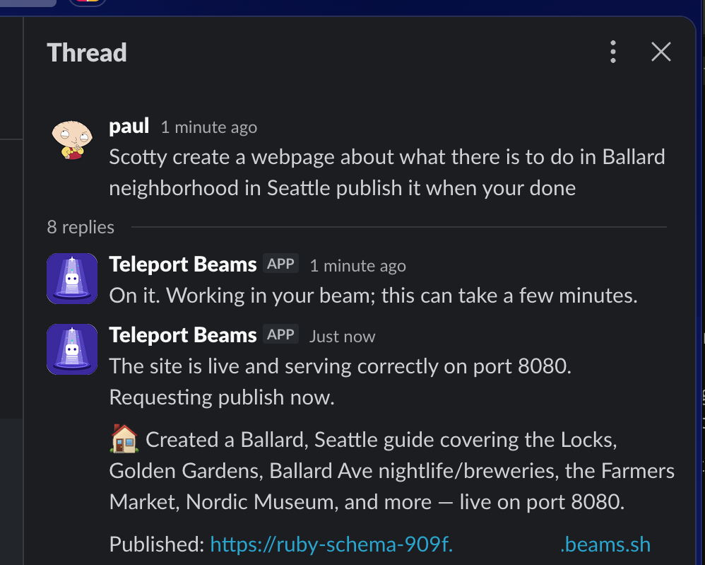
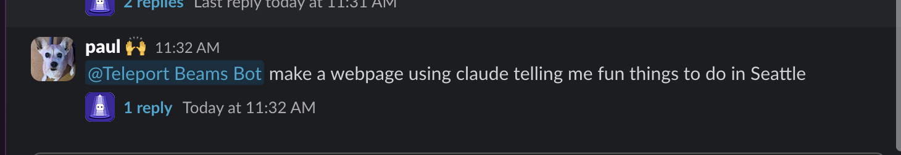
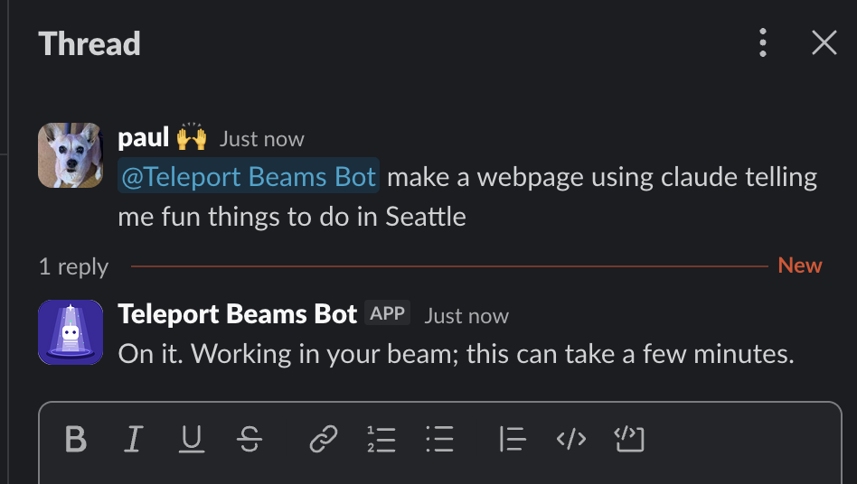
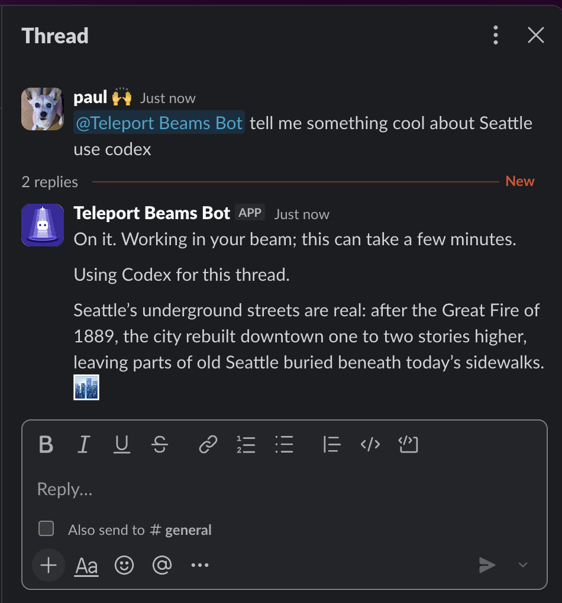
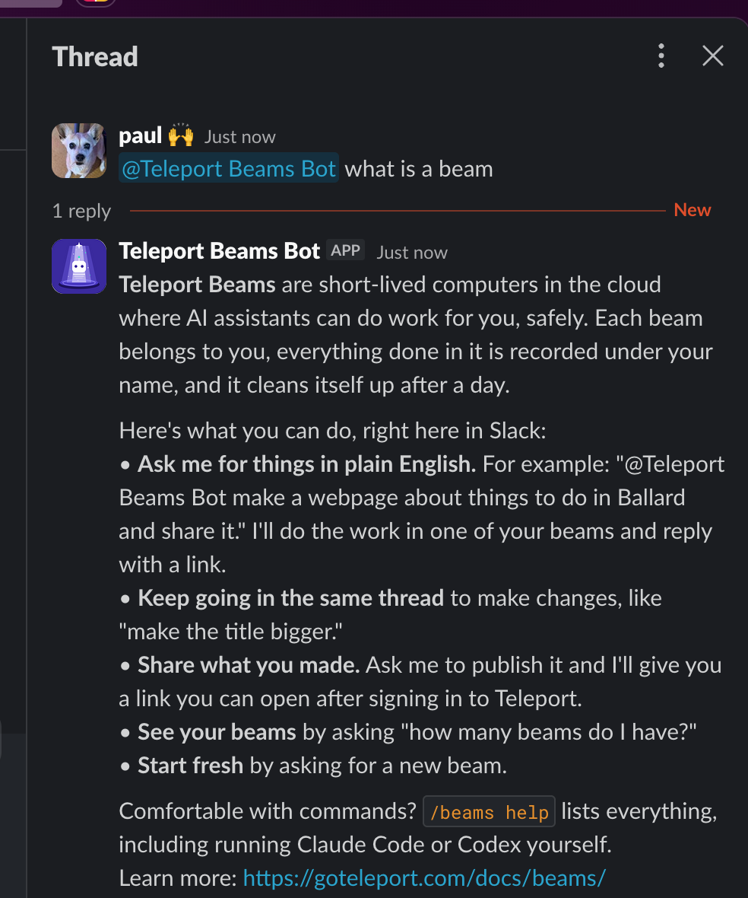
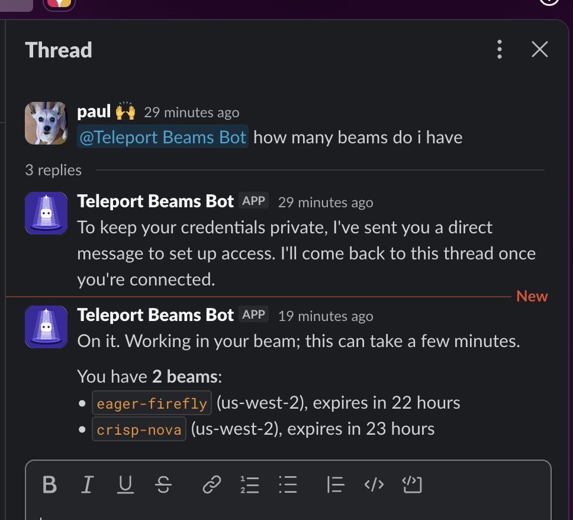
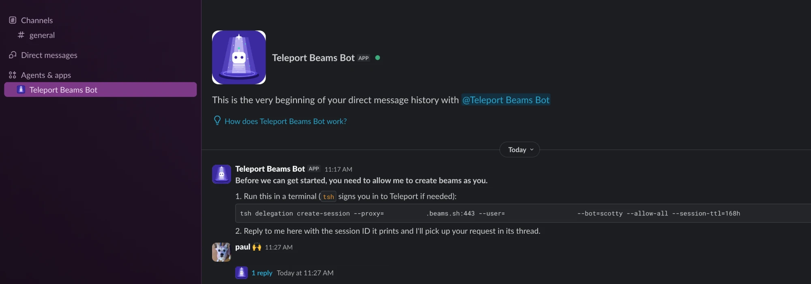
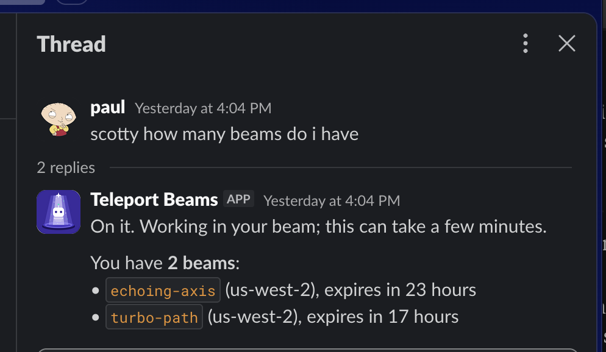
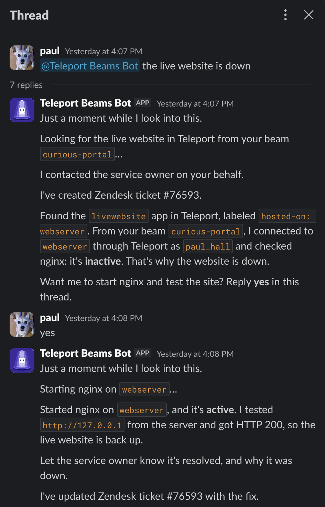

# Beams Slack Plugin


An operations agent in Slack that works through Teleport. Tell the **Teleport
Beams Bot** what's wrong or what you need ("@Teleport Beams Bot live website is
down", "@Teleport Beams Bot build a status page and publish it") and it does
the work in [Teleport Beams](https://goteleport.com/docs/beams/), reaches your
servers and apps through Teleport, keeps the right people informed, and asks
before it changes anything. Everything runs as you and lands in Teleport's
audit log. There's also a `/beams` slash command for direct control.

It is Teleport's Slack access plugin with a Beams app added. It is built from
the Teleport `v18.11.1` source (the newest public v18.11 tag) and ships with
`tsh` 18.11.3; the `tbot` sidecar runs 18.11.3 too. See
[Versions](#versions). It runs as a container next to `tbot`, talks to Slack
over Socket Mode, and needs no inbound ports or public URL.

**[Usage](#usage)** · **[Request log](#request-log)** · **[Installation](#installation)** ·
**[Deploy with Terraform](#deploy-with-terraform)** ·
**[Development](#development)**

## What it does

- **Incident response**: say "live website is down" and the bot notifies the
  service owner, opens a ticket, finds the server behind the site through
  Teleport, diagnoses the problem, and offers to fix it. Say yes, and it
  fixes it, verifies the site, and tells the owner it's resolved and why.
- **Real work in beams**: Claude Code or Codex runs in one of your beams to
  write and run code, build pages and services, and publish them behind
  Teleport. Claude proposes a plan and waits for your yes before changing
  anything.
- **Keeps people informed**: "tell Anna the site is down" messages Anna in
  the thread, or by direct message, right away.
- **Acts as you, on the record**: every action runs as your own Teleport
  user through a delegation you approve (up to 7 days), so it can only reach
  what you can, beams it creates are yours, and every step is in Teleport's
  audit log under your name.
- **Who you are**: the plugin matches your Slack email to your Teleport user
  and lets you in only if that user has the configured role (`beam-user`). No
  list of Slack IDs to maintain.
- **`/beams` slash commands**: list, create, run commands in, publish, copy
  files to, and delete beams directly. Replies are private to you.

Ask for a web page and get back a URL you can open:



## Usage

**Teleport Beams** are short-lived computers in the cloud where AI assistants
can do work for you, safely. Each beam belongs to you, everything done in it
is recorded under your name, and it cleans itself up after a day.

Here's what you can do, right in Slack:

- **Report a problem.** "@Teleport Beams Bot live website is down" starts the
  [incident response](#incident-response): the service owner hears about it,
  a ticket is opened, and the bot finds and diagnoses the server behind the
  site through Teleport, then offers the fix. Reply "yes" and it fixes and
  verifies it.
- **Get work done.** "@Teleport Beams Bot make a webpage about things to do in
  Ballard and share it." The bot works in one of your beams, shows you its
  plan, and once you say yes, does the work and replies with a link. Mention
  it in a channel, and it answers in a thread under your message:

  

  

- **Loop people in.** "tell Anna the website is down" messages Anna for you,
  right away.
- **Hand it files.** Attach logs, configs, or screenshots to your message;
  files are copied into your beam for the agent to use, and images can be
  looked at directly.
- **Keep going in the same thread** to make changes, like "make the title
  bigger."
- **Share what you made.** Ask the bot to publish it and you get a link you can
  open after signing in to Teleport.
- **Manage your beams**: "how many beams do I have?", "create a new beam",
  "delete curious-shield", "delete this beam" in its thread, or "delete all
  my beams".
- **Pick your agent.** Teleport Beams Bot uses Claude Code unless you say "use
  codex" (or "use claude" to switch back):

  

- **Ask how to do something.** Quick questions, like the `curl` command to
  check a site, are answered in seconds without starting a beam. These go
  through Teleport too, so they're in the audit log under your name.

Comfortable with commands? `/beams help` lists everything, including running
Claude Code or Codex yourself (see [Slash commands](#slash-commands)).

Ask Teleport Beams Bot "what can I do with beams?" or "what is a beam?" for a
short version in Slack:



Learn more in the [Teleport Beams docs](https://goteleport.com/docs/beams/).

## Slash commands

```text
/beams help
/beams status
/beams ls
/beams add [--region=<region>]
/beams exec <name> <command...>
/beams claude <name> [--continue] <prompt...>
/beams codex <name> [--continue] <prompt...>
/beams publish <name> [--tcp]
/beams unpublish <name>
/beams rm <name>
/beams scp <src> <dst>             # remote side is <name>:<path>
/beams connect [<delegation-session-id>]
/beams disconnect
```

- `ls` lists your beams with region, time left, and published URL:

  

- `exec` runs over SSH as a single shell string, so quote commands that use
  `&&`, pipes, or redirects: `/beams exec crisp-array "cd /app && make"`.
  Other commands are split into words like a shell, so wrap any argument
  that contains an apostrophe in double quotes. Beam names pasted from Slack
  code formatting (with backticks) work as is.
- `claude` and `codex` run a coding agent in the beam and post its answer:
  Claude Code (`claude -p`) or Codex (`codex exec`). Both come preinstalled
  and preconfigured in every beam. Each run has a 15 minute limit, and
  `--continue` (or `-c`) resumes that agent's previous conversation in the
  beam, for example `/beams codex fabled-firefly -c add a dark mode`.
  Everything after the beam name (and `-c`) is sent as typed, so prompts can
  contain apostrophes without quoting. Teleport Beams Bot can use either one; see
  [Teleport Beams Bot](#teleport-beams-bot).
- `publish` exposes port 8080 in the beam as a Teleport app.
- Interactive `/beams ssh` is not supported; use `exec`.
- A brand-new beam takes a moment to accept SSH; commands retry for up to 3
  minutes.
- Until you connect, every beam command replies with the authorization
  instructions instead of running.

## Teleport Beams Bot

Talk to Teleport Beams Bot in any of these ways:

- `@Teleport Beams Bot <request>` in a channel the app is in
- a direct message to the app
- a channel message starting with "Teleport Beams Bot" (needs the
  `message.channels` event)
- a reply in a thread Teleport Beams Bot is already working in (no mention needed)

The first time (and again when your authorization expires), Teleport Beams Bot
sets up access with you in a direct message, so nothing about your credentials
is posted in a shared channel. The thread just gets a note that it has messaged
you, and the DM says:

> **Before we can get started, you need to allow me to create beams as you.**
>
> 1. Run this in a terminal (`tsh` signs you in to Teleport if needed):
>    `tsh delegation create-session --proxy=... --user=you@example.com ...`
> 2. Reply to me here with the session ID it prints and I'll pick up your
>    request in its thread.

The command already includes your Teleport username, matched from your Slack
email. Reply to the DM with the session ID (or the whole command output);
Teleport Beams Bot connects you and then carries out your original request back
in the thread where you asked it. This is the same connection `/beams connect`
makes, and it lasts up to 7 days.

In the channel, the thread only gets a pointer to the DM, and the request is
answered there once you're connected:



The direct message with the instructions, and the reply with the session ID
(the tenant name, email, and session ID are hidden):



Questions about which beams you have ("how many beams do I have", "list my
beams") are answered straight from `tsh beams ls` in a second or two. Quick
questions get an answer in a few seconds (see [Quick answers](#quick-answers)),
and work in a beam with Claude Code or Codex usually takes a minute or more.
Teleport Beams Bot acknowledges right away: "Just a moment while I look into
this." for a new question, followed by a note if the request turns into work in
a beam, or "On it. Working in your beam" in a thread that already works in
one. Teleport Beams Bot works
on one request per thread at a time: if you send another message while it is
busy, it replies "Still working on your earlier request" and handles your
newest message as soon as the current one finishes.



### Incident response

When `incident_response` is on, "@Teleport Beams Bot live website is down"
runs the whole response in the thread:

1. **Notifies the service owner.** The bot sends `service_owner` (or whoever
   you name, as in "live website is down, tell Paul Hall") a direct message,
   "There's an issue with the live website.", and replies "I contacted the
   service owner on your behalf."
2. **Opens a ticket.** It replies with a Zendesk ticket number. This step
   isn't connected to Zendesk yet, so no ticket is actually created.
3. **Diagnoses the problem from one of your beams** (the thread's, your newest,
   or a new one). `tsh` in a beam is signed in as you, so every step is
   audited as you. The bot lists apps with `tsh apps ls`, takes the one with a
   `hosted-on` label, connects to that server with `tsh ssh` as
   `incident_ssh_login`, and checks `systemctl is-active nginx`. If nginx is
   down, it says so and offers to start it.
4. **Fixes it when you say yes.** Reply "yes" in the thread and it runs
   `systemctl start nginx` (with `sudo -n` for a login other than root),
   checks the app's URL with `curl` from the server, tells the service owner
   "The issue was resolved." and why the site was down, and updates the
   ticket.

Reply "no" to leave the server as it is.



### Telling people

Ask the bot to pass something on, and it messages that person for you:

> @Teleport Beams Bot there's an incident on the production webserver, tell
> Anna the website is down and write a script to test connectivity

- **Who:** use a name ("Anna", or a Slack handle) or an
  @-mention. The bot looks the name up in your Slack workspace
  (`users:read`). If more than one person matches, or nobody does, it says so
  and doesn't send anything; give a fuller name to pick one.
- **Where:** in a channel thread, the bot posts the note in the thread and
  @-mentions them ("@Anna message from @you: The production website is down.
  We're on it."). In a direct message with the bot, it sends them a direct
  message instead.
- **When:** right away, before any work in a beam starts, so an incident
  heads-up doesn't wait for the script. Claude or Codex writes the note from
  what you asked to pass on, and adds that we're on it when it's about a
  problem.

### Attachments

Files attached to a message (or posted on their own in a bot thread) come
with the request. The bot downloads them with the `files:read` scope, only
from Slack's file hosts, up to 5 files of 20 MB each.

- **Images with a quick question:** up to two JPEG, PNG, GIF, or WebP images
  of 3.5 MB each, such as a screenshot of an error, are sent to the model with
  the question so it can read them. The thread history keeps only a note of
  the image.
- **Anything else** (other file types, larger or more images, or requests that
  need a computer) runs in a beam. The files are copied into
  `/tmp/slack-attachments/` there with `tsh beams scp` as you, and the coding
  agent is told their paths.

### Work in a beam

For requests that need a computer, Teleport Beams Bot:

1. Picks one of your own beams: the one this thread already uses, a beam you
   named, or your newest. If you have none, it creates one, owned by you.
2. Runs a coding agent in that beam with your request: Claude Code by
   default, or Codex if you say "use codex", "with codex", or start with
   "codex". The thread keeps using that agent (say "use claude" to switch
   back), and switching starts a fresh conversation. The agent is told to
   serve anything it wants to share on port 8080 in the background.
3. **Asks before Claude Code changes anything.** Claude first runs in plan
   mode, where it can look around but not change anything. Questions it can
   answer that way get an answer. Otherwise the bot posts Claude's plan with
   "Reply *yes* to go ahead, or tell me what to change." In the thread:
   - **yes** (or "go ahead", "lgtm", …) resumes the same Claude conversation
     with permission to act, and it carries out the plan.
   - **no** drops the plan.
   - **anything else**, even "yes, but use port 9090", goes back to Claude to
     revise the plan.

   Codex doesn't ask; it acts right away.
4. Carries out actions the agent asks for (`publish`, `unpublish`,
   `create_beam`) from outside the beam, since it cannot manage beams from
   inside the VM.
5. Replies in the thread with the agent's answer and any published URL.

Asking for another beam creates one, and the rest of that thread works in it:


To delete beams, tell Teleport Beams Bot "delete" followed by their names (for example
"delete curious-shield and mint-arc"), "delete this beam" in the beam's
thread, or "delete all my beams". Teleport Beams Bot handles this itself rather than asking the coding agent, and
only when the beam names come right after the word "delete" or "remove", so a
request like "remove the header from the page in mint-arc" is still sent to
the agent. You can also use `/beams rm <name>`.

### Quick answers

Questions that don't need a computer ("what's the curl command to check a
site?", "what does this nginx error mean?") are answered by the model
directly, with no beam. Teleport
Beams Bot asks Teleport for a short-lived certificate for the tenant's `anthropic`
app (or `openai` with "use codex") as you, through your delegation, and sends
the request through Teleport's app proxy, which adds the provider's API key.
Every quick answer is an app session in Teleport's audit log, attributed to you
and the bot.

The model is told to hand off anything that needs a computer: running or
testing code for you, creating files or pages, installing software,
publishing, or managing beams. A command or short script you can run yourself,
such as a `curl` check that a site is up, comes back as a quick answer instead.
Handed-off requests continue in a beam as described
below, with the thread so far passed to the coding agent as context. Once a
thread is working in a beam, follow-ups go to the agent in that beam, and
naming one of your beams always goes straight to it. If the tenant has no
model apps, every request goes to a beam as before; if a model call fails, the
bot reports the error instead of starting work in a beam.

The chat models are set with `chat_claude_model` (default `claude-sonnet-4-5`)
and `chat_codex_model` (default `gpt-5`); the tenant maps these names to the
models it serves. Claude answers use the Anthropic Messages API and Codex answers
the OpenAI Responses API, the routes Teleport's model apps serve for every
model. `disable_chat = true` turns quick answers off.

Teleport Beams Bot is an engineer at heart, not a transporter operator, so
don't ask it for a lift.

## Request log

Teleport records what the bot does on your behalf, but not exactly what you
asked:

- **Work in a beam** (the bot's agent runs and `/beams claude|codex|exec`) is
  an SSH command run as you, and Teleport's audit log has the full command
  line, prompt included.
- **Quick answers** appear as an app session for you via the bot, plus an
  `app.session.llm_request` event per request with the model and token
  counts. Teleport doesn't record the prompt there, and plugins can't write
  their own audit events. So after answering, the bot also runs a harmless
  `printf` of the question and answer in one of your beams (the newest), as
  you. Teleport audits that command like any other, with the question and
  answer in its command line. If you have no beams, this step is skipped.

The plugin also logs one structured line per request with the
message `Beams bot request`:

| Field | Meaning |
| --- | --- |
| `kind` | `chat` (quick answers), `beam`, `incident`, `tell`, `delete`, `list`, or `slash` |
| `slack_team_id`, `slack_user_id` | Who asked, in Slack |
| `teleport_user` | The Teleport user it ran as |
| `request` | What they asked (up to 2,000 characters) |
| `agent`, `model`, `app` | For quick answers: Claude or Codex, the model, and the Teleport app |
| `app_session_id` | For quick answers: the Teleport app session, matching its `app.session.llm_request` events |
| `beam`, `continued`, `attachments` | For beam work: the beam, whether the agent conversation continued, and attached file names |
| `command`, `beams` | The slash command, or the beams deleted |
| `to_slack_user_id` | For `tell`: who was messaged (`request` is the message) |

`/beams connect` is not logged, so session IDs stay out of the logs. Set
`omit_request_text = true` to log everything except the request text. Ship
the plugin's logs to the same place as Teleport's audit export to see both
together.

## Authorizing the plugin to act as you

Teleport v18 does not let a bot impersonate an SSO user, and only you can
create a delegation session for yourself (with MFA). So the first time you use
`/beams` or Teleport Beams Bot, and again when your authorization expires, the plugin
replies:

> **Before we can get started, you need to allow me to create beams as you.**
>
> 1. Run this in a terminal (`tsh` signs you in to Teleport if needed):
>    `tsh delegation create-session --proxy=example-beams-tenant.beams.sh:443 --user=you@example.com --bot=teleport-beams-bot --allow-all --session-ttl=168h`
> 2. Run `/beams connect <session-id>` with the ID it prints.

With slash commands the prompt is a reply only you can see. This is how it
looks (the tenant name and email are hidden):


Run it, then hand back the session ID it prints:

- with Teleport Beams Bot: reply to its direct message; it then carries out
  your request in the thread where you asked it
- with slash commands: `/beams connect <session-id>`

For the next 7 days every beam action runs as your Teleport user: beams are
owned by you, published URLs open for you, and Teleport keeps your beams
separate from everyone else's. `/beams disconnect` forgets the session.

The plugin never creates or touches beams as its own bot identity.

## Installation

### 1. Teleport

The plugin runs as a Machine ID bot (named `teleport-beams-bot` here). Its role needs
`read` and `list` on `user` and `user_login_state` so it can match Slack
emails to Teleport users. The deployment uses `access-plugin` (the role
Teleport's Slack plugin normally uses, extended with those rules) plus
`beam-user`. Beam actions themselves run as each user through delegation, so
the bot does not strictly need `beam-user` any more.

```sh
tctl bots add teleport-beams-bot --roles=access-plugin,beam-user    # or: tctl bots update teleport-beams-bot --set-roles=...
tctl bots instances add teleport-beams-bot                         # prints a one-time join token
```

Each person who uses the plugin needs a Teleport user whose username is their
Slack email (true for typical SSO setups) and the `beam-user` role. SSO users
only exist in Teleport while their login is current, so someone who has never
signed in is told to sign in once and retry.

### 2. Slack app

The quickest way is to create the app from
[`slack-app-manifest.yaml`](slack-app-manifest.yaml): at
<https://api.slack.com/apps>, choose **Create New App → From a manifest**, pick
your workspace, and paste the file. It sets up everything below except the
app-level token and the icon. To configure an existing app by hand instead:

- **Socket Mode**: on. Create an app-level token (`xapp-...`) with
  `connections:write`.
- **Slash Commands**: add `/beams`.
- **Event Subscriptions**: on (no request URL needed with Socket Mode).
  Subscribe to bot events `app_mention`, `message.im`, `message.channels`,
  and `message.groups` for private channels. The plugin ignores channel
  messages that are not meant for Teleport Beams Bot.
- **OAuth & Permissions, Bot Token Scopes**: `commands`, `chat:write`,
  `users:read`, `users:read.email`, `app_mentions:read`, `im:history`,
  `channels:history`, `groups:history`, `files:read` (for attachments).
- **App Home**: enable the Messages tab and "Allow users to send messages".
  Set the display name to `Teleport Beams Bot`.
- **App icon**: see [Set the bot's icon](#set-the-bots-icon) below.
- **Install / Reinstall to Workspace** after any scope change, then
  `/invite` the app to the channels where it should listen. Once added, it
  shows under the channel's **Agents & apps** tab:

  

#### Set the bot's icon

The bot's icon is [`assets/slack-beams-bot.png`](assets/slack-beams-bot.png), a
1024 x 1024 PNG.

1. Download it. On GitHub, open the file and click **Download raw file**, or
   use the copy in your clone of this repo.
2. At <https://api.slack.com/apps>, open the app and go to **Basic
   Information**.
3. Scroll to **Display Information**. Under **App icon**, click **Add App
   Icon** (or the current icon) and upload `slack-beams-bot.png`. Slack accepts
   square images from 512 x 512 to 2000 x 2000 pixels.
4. Set **Background color** to `#3B2A9E`, the icon's own purple, so it
   blends in. Set **App name** to `Teleport Beams Bot` and fill in a short description if
   you like.
5. Click **Save Changes**. The new icon appears on the bot's messages and
   profile within a few minutes. No reinstall is needed for the icon.

### 3. Build and host the image

The plugin image is not published publicly, so build it yourself and put it
in a registry your Docker host can pull from (or build it on that host).
From this directory:

```sh
docker build --platform linux/amd64 -t <registry>/beams-slack-plugin:latest .
docker push <registry>/beams-slack-plugin:latest
```

The build clones Teleport, applies `teleport.patch`, and bundles `tsh`, so it
takes a while. Then tell Compose which image to run:

```sh
export BEAMS_SLACK_PLUGIN_IMAGE=<registry>/beams-slack-plugin:latest
```

`docker-compose.yml` refuses to start without it. You can also put the value
in a `.env` file next to `docker-compose.yml`.

#### Building on the Docker host instead

Without a registry, or when CI is down, build on the host that runs the stack
and use the local tag. Only `Dockerfile` and `teleport.patch` are needed:

```sh
mkdir build && cp Dockerfile teleport.patch build/ && cd build
docker build -t beams-slack-plugin:local-$(git rev-parse --short HEAD) .
```

(Run `git rev-parse` in your checkout, or pick any tag.) The build takes about
ten minutes. Set `BEAMS_SLACK_PLUGIN_IMAGE` to that tag and recreate only the
plugin:

```sh
docker compose up -d --no-deps teleport-slack
```

Use a tag that doesn't exist in any registry. Auto-updaters such as Watchtower
pull newer images for running containers, so tagging a local build like a
registry image (for example `.../beams-slack-plugin:latest`) could get it
replaced with an older published build. To return to a registry image, set the
variable back and `docker compose pull teleport-slack` before recreating.

### 4. Run it

Run it with Docker Compose as below, or let Terraform deploy everything,
including the Teleport bot and join token: see
[Deploy with Terraform](#deploy-with-terraform).

From a directory containing this repo's `docker-compose.yml`, `tbot.yaml`,
your `config.toml`, and a `secrets/` directory:

```sh
printf '%s' '<join-token>' > secrets/tbot-token
docker volume create beams-profiles    # first install only
docker compose up -d
docker compose logs tbot               # should show "Identity initialized successfully"
```

The stack has three services:

- `volume-init` gives the shared volumes to UID 10001 and exits.
- `tbot` joins as `teleport-beams-bot` and keeps an identity file renewed (every 20
  minutes) in the `plugin-identity` volume. The join token is only used once;
  `tbot` renews from the `tbot-state` volume afterwards. If that volume is
  lost, or `tbot` is down longer than its 1 hour certificate, create a new
  instance token.
- `teleport-slack` is the plugin, running the image you built and set in
  `BEAMS_SLACK_PLUGIN_IMAGE`. `secrets/` is mounted at
  `/var/lib/teleport/plugins/slack`, and per-user state lives in the external
  `beams-profiles` volume.

To deploy a new image, build and push it again (or build it on the host, as
above), then:

```sh
docker compose pull teleport-slack && docker compose up -d --no-deps teleport-slack
```

### 5. Configuration

Start from `config.toml.example`. The Beams settings:

| Key | Default | Meaning |
| --- | --- | --- |
| `enabled` | `false` | Turn on `/beams` and Teleport Beams Bot |
| `proxy` | `teleport.addr` | Teleport proxy for `tsh` |
| `plugin_identity` | `teleport.identity` | Identity file from `tbot` |
| `tsh_path` | `tsh` | `tsh` binary (bundled in the image) |
| `profiles_dir` | temp dir | Per-user state; use the `beams-profiles` volume |
| `required_role` | none | Teleport role a Slack user's matching Teleport user must have |
| `users` | none | Optional `"<slack-user-id>" = "<teleport-user>"` overrides that skip the role check |
| `bot_name` | none | Bot named in delegation sessions (`teleport-beams-bot`); required to use Beams |
| `delegation_ttl` | `168h` | Session length in the suggested `tsh` command (Teleport max 7 days) |
| `identity_ttl` | `15m` | Lifetime of per-command delegated certificates (max 1h) |
| `command_timeout` | `2m` | Limit for normal commands |
| `claude_timeout` | `15m` | Limit for `/beams claude` and the bot's Claude runs |
| `claude_args` | `["--dangerously-skip-permissions"]` | Extra Claude Code flags for `/beams claude`, which can't ask for approval. Bot requests set permission flags themselves and drop these. |
| `claude_skip_approval` | `false` | Let Claude Code act on bot requests without a plan approved in Slack first |
| `codex_timeout` | `15m` | Limit for `/beams codex` and the bot's Codex runs |
| `chat_claude_model` | `claude-sonnet-4-5` | Model for quick answers through the `anthropic` app |
| `chat_codex_model` | `gpt-5` | Model for quick answers through the `openai` app ("use codex") |
| `omit_request_text` | `false` | Leave what users asked out of the [request log](#request-log) |
| `disable_chat` | `false` | Send every request to a coding agent in a beam instead of answering quick questions directly |
| `incident_response` | `false` | Turn on [incident response](#incident-response) for "live website is down" |
| `incident_ssh_login` | `root` | Login incident response uses on the website's server |
| `service_owner` | none | Slack name of the person incident response notifies |
| `codex_args` | `["--dangerously-bypass-approvals-and-sandbox"]` | Extra Codex flags, for the same reason. `--skip-git-repo-check` is always added because a beam's home directory is not a Git repository. |

`required_role` or `users` must be set. Socket Mode reuses `review.app_token`
for the `xapp-` token even when access-request review is disabled.

## Deploy with Terraform

[`terraform/`](terraform) deploys the whole stack in one apply:

- **Teleport:** the `teleport-beams-bot` bot (roles `access-plugin`, Teleport's preset
  role for access plugins, plus `beam-user`) and a `bound_keypair` join token
  with a generated registration secret. Unlike a one-time join token, it isn't
  used up, so later applies leave the running `tbot` alone, and `tbot` can
  rejoin with its key after an outage.
- **Docker:** the `tbot` and plugin containers and their volumes, on the local
  Docker daemon or a remote one over SSH. The configs and Slack tokens are
  copied into the containers as files, so the host needs no checkout.

The Slack app and the plugin image stay manual: Slack has no Terraform
provider for apps, and the image has to be built and pushed somewhere your
Docker host can pull from.

### Bootstrap

1. **Slack app.** Create it from the manifest and set its icon ([Slack
   app](#2-slack-app)). Install it to the workspace, then copy the **Bot User
   OAuth Token** (`xoxb-…`, under **OAuth & Permissions**) and create an
   app-level token (`xapp-…`) with `connections:write` under **Basic
   Information → App-Level Tokens**.
2. **Plugin image.** Build and push it ([Build and host the
   image](#3-build-and-host-the-image)). Use an immutable tag such as
   `sha-<commit>`, so Terraform deploys exactly that build.
3. **Teleport credentials for Terraform.** Sign in as a Teleport user who can
   create bots, roles and join tokens (for example with the `editor` role),
   then let `tctl` mint short-lived credentials for the provider:

   ```sh
   tsh login --proxy=example-beams-tenant.beams.sh:443
   eval "$(tctl terraform env)"
   ```

4. **Docker access.** Make sure `docker ps` works against the target host. For
   a remote host, use SSH (`docker_host = "ssh://user@host"`); your SSH user
   needs to be allowed to use Docker there.
5. **Variables.** Copy the example and fill it in. The file is git-ignored.

   ```sh
   cd terraform
   cp terraform.tfvars.example terraform.tfvars
   ```

   At minimum set `teleport_proxy`, `plugin_image`, `slack_bot_token`, and
   `slack_app_token` (or pass the tokens as `TF_VAR_slack_bot_token` and
   `TF_VAR_slack_app_token`). See `variables.tf` for the rest.
6. **Apply.**

   ```sh
   terraform init
   terraform apply
   ```

7. **Check it.** `tbot` should log "Identity initialized successfully" and the
   plugin "Receiving Socket Mode events":

   ```sh
   docker logs beams-slack-tbot
   docker logs beams-slack-plugin
   ```

   Then `/invite` the app to a channel and ask it "what can I do with beams?".

Users still need a Teleport user named after their Slack email with the
`beam-user` role, and they authorize the bot the first time they use it
([Authorizing the plugin to act as you](#authorizing-the-plugin-to-act-as-you)).

### Updating and secrets

- **New plugin build:** push it, set `plugin_image` to the new tag, and
  `terraform apply`. Only the plugin container is replaced.
- **Rotating Slack tokens:** update the variables and apply; the plugin
  container is recreated with the new files.
- **State holds secrets.** The Slack tokens and the bot's registration secret
  are in Terraform state, so keep state in an encrypted, access-controlled
  backend rather than a shared or committed `terraform.tfstate`.
- Destroying the stack deletes the volumes, including users' delegation
  sessions; they will be asked to authorize the bot again.

## Development

The plugin source is a patch against Teleport, not a fork.
`teleport.patch` holds every change relative to `v18.11.1`, including new
files, and the Docker build applies it to a fresh checkout.

```sh
git clone https://github.com/gravitational/teleport.git && cd teleport
git worktree add --detach ../tp v18.11.1 && cd ../tp
git apply /path/to/beams-slack-plugin/teleport.patch && git add -N .
# edit integrations/access/slack/...
go build ./integrations/access/slack/... && go vet ./integrations/access/slack/
GOTOOLCHAIN=go1.25.14 go test ./integrations/access/slack/
git diff --binary v18.11.1 --output=/path/to/beams-slack-plugin/teleport.patch
```

- `git add -N .` makes new files show up in the diff.
- Run tests with Go 1.25 (`GOTOOLCHAIN=go1.25.14`). A dependency
  (`charlievieth/strcase`) panics at startup under Go 1.27.
- The tests use a fake `tsh` script, so no Teleport cluster is needed.

Main files under `integrations/access/slack/`:

| File | Purpose |
| --- | --- |
| `beams_app.go` | Socket Mode loop, slash-command and Teleport Beams Bot message handlers |
| `beams_commands.go` | `/beams` commands, user lookup, delegation and authorization prompts, `tsh` runner |
| `beams_bot.go` | Teleport Beams Bot request parsing, beam and agent choice, agent prompt, actions |
| `socketmode.go`, `types.go` | Slash-command and Events API envelope decoding |
| `bot.go` | Slack replies (`response_url` and threaded `chat.postMessage`) |
| `config.go` | `[beams]` settings and validation |

## Container builds

The original repository has a GitHub Actions workflow
(`.github/workflows/beams-slack-plugin-container.yml`) that builds pull
requests and pushes `main` to a private GitHub Container Registry package with
tags `latest`, `main`, and `sha-<commit>`. That package is not publicly
accessible, so use your own registry as described in
[Build and host the image](#3-build-and-host-the-image). If GitHub Actions is
unavailable, [build on the Docker host](#building-on-the-docker-host-instead)
instead. The image bundles
`tsh` 18.11.3; override the `TSH_VERSION` build argument when the tenant is
upgraded.

## Versions

| Piece | Version | Set in |
| --- | --- | --- |
| Plugin source (`teleport.patch` base) | `v18.11.1` | `Dockerfile` `TELEPORT_REF` |
| Bundled `tsh` | 18.11.3 | `Dockerfile` `TSH_VERSION` |
| `tbot` sidecar | 18.11.3 | `docker-compose.yml` |

Teleport published 18.11.3 binaries without a public `v18.11.3` source tag,
so the plugin is built from `v18.11.1`, the newest tag available. Mixing patch
releases within 18.11 is supported. Move `TELEPORT_REF` (and rebase
`teleport.patch`) when a newer tag is published.
